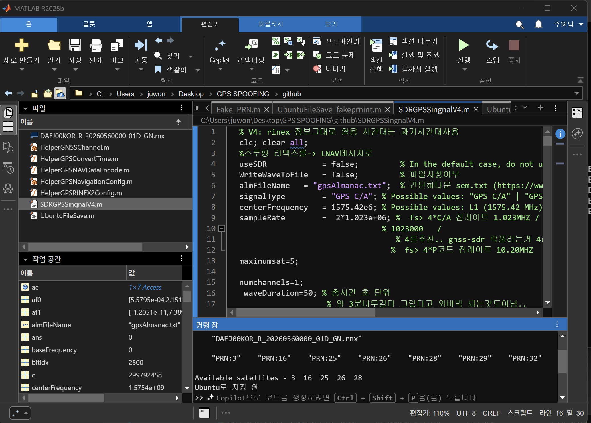
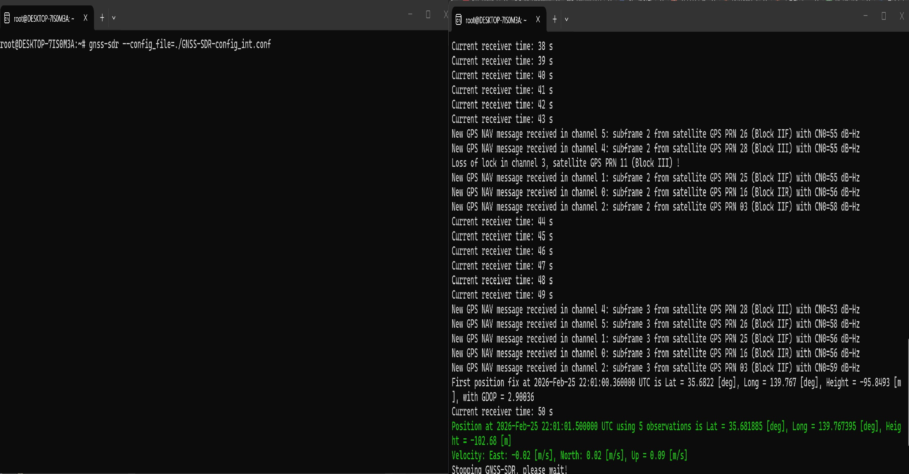
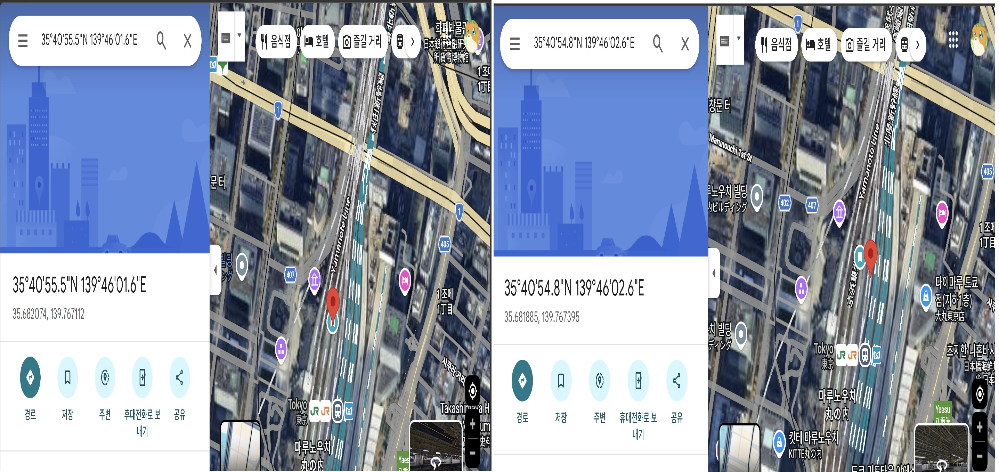
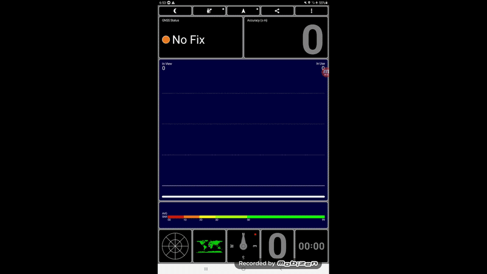

# GPS Signal
고정된 수신기 위치의 GPS L1 C/A 신호를 생성하는 MATLAB 코드입니다 
Matlab에서 제공하는 툴박스(Wireless,AeroSpace..)들과 예제파일(HelperGPSConverTime,HelperGNSSChannel..)들을 사용했습니다 

원하는 날짜와 시간대의 GPS RINEX V3 파일을 https://cddis.nasa.gov/archive/gnss/ 에서 다운로드 한 후
메인 스크립트내의 변수들을 원하는 값들로 수정합니다 

대표변수 
sampleRate: GPS신호를 생성할 샘플링 주파수 
maximumsat: 신호에 반영할 최대 위성 수 
waveDuration: 신호가 시뮬레이션하는 총 시간(s) 
rinexFileName: 다운로드한 RINEX파일 이름 
rxlla:신호가 시뮬레이션 하는 수신기 위도,경도 값 

# GNSS-SDR 검증 
MATLAB으로 50초 GPS 신호를 생성 한 후 
GNSS-SDR 소프트웨어를 사용하여 생성한 Baseband GPS 신호를 검증했습니다 
2026년 2월 25일에 올라온 RINEX파일을 사용하고 수신기 위치는 도쿄 (35.682074,139.767112,8)로 설정했습니다. 
전송시간은 2026-02-25 22:00:12 UTC 입니다. 

MATLAB 코드생성 

GNSS-SDR에서 수신기 위치 추적 

설정한 수신기 위치 & GNSS-SDR이 계산한 수신기 위치 

# RF
문제가 될 부분이 있어 결과 이미지만 첨부. 

갤럭시 탭 A  
 

루나리스 GPS 시계(UTC 22:00= KST 07:00) 

SDRGPSSignalV4.m: 메인 스크립트  
HelplerGNSSChannel.m: MATLAB에서 제공하는 예제파일입니다. 딜레이+도플러 적용 연산을 줄이기 위해 수정했습니다  
HelperRINEX2Config: MATLAB에서 제공, GNSS-SDR과의 호환성을 위해 수정  
HelperGPSConverTime.m : MATALB에서 제공하는 UTC-> GPST 변환  
HelpperGPSNaviationConfig: MATALB 제공  
DAEJ00KOR_R_20260560000_01D_GN.rnx: GPS신호생성에 사용한 RINEX파일   
GNSS-SDR-config_int.conf: GNSS-SDR 설정 파일   
UbuntuFileSave.m: 가상환경 우분투 저장소로 파일을 저장    
